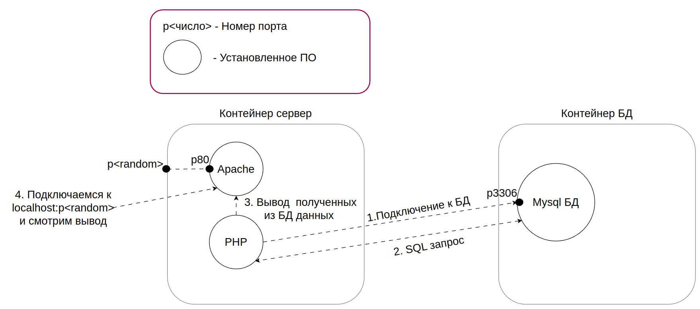

# 
 Общее описание задания 

Создайте сайт, который выводит таблицу значений на экран. Разверните его с помощью двух докер-контейнеров (сервер и база данных)

_
  
_

## Что нужно использовать при решении

* Образ __Apache__ и __php 7.4;__
* __docker-compose;__
* образ __mysql:5.7;__
* скрипт __index.php;__
* скрипт __init.sql__ для создания базы данных.

## Требования к контейнерам:

1. База данных должна содержать __минимум__ одну таблицу с двумя столбцами и тремя записями
2. Структура и наполнение базы данных - на ваше усмотрение
3. Тематика наполняемых данных должна отличаться от примеров.

